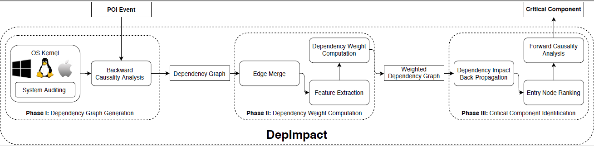

# DepImpact
## Introduction

Causality analysis on system auditing data has emerged as an important solution for attack investigation.
Given a POI (Point-Of-Interest) event (e.g. an alert fired on a  suspicious file creation), causality analysis constructs a dependency graph, in which nodes represent system entities (e.g. processes and files) and edges represent dependencies among entities, to reveal the attack sequence.
However, causality analysis often produce a huge graph.
We propose DepImpact identifies the gritical component of a dependency graph by assigning discriminative weights to edges to distinguish critical edges that represent the attack seqence from less-important dependencies,
propagating dependency impacts backwards from the POI event to entry points, and ranking entry points by their impacts. 
In particular, DepImpact performs forward causality analysis from the top-ranked entry points that are likely to be the attack entries to filter out edges in the original dependency graph that are not found in the forward causality analysis. 

## Requirements
JAVA Version：1.8
## Usage
### Input
1. Log file
2. Path of output
3. File includes necessary parameters
### Command
java -jar DepImpactJar-1.0-SNAPSHOT-jar-with-dependencies.jar log-path output-path parameter-file-path

### Data
Due to the limit of Github, we can't upload the extreme large log file. 
The folder example contains a log and parameter file that can be used for demo. For this case, the POI event is a file, which contains the user's sensitive information.
For the DARPA Attack used in evaluation, here is the [github link](https://github.com/darpa-i2o/Transparent-Computing). 
You can follow their instructions to download data.  
### Output
DepImpact will output several different files.
1. The original dependency graph of the given POI event, the file name starts with Backtrack
2. The dependency graph processed by the edge-merge module.
3. A json file contains the final weight of each edge, this file ends with weights
4. There are two files contains entry points. The name are start_rank. One is json file, the other one is txt file.
5. The folder DepImact includes the critical components. This folder contains a txt file, which shows the entry point of the critical component.

